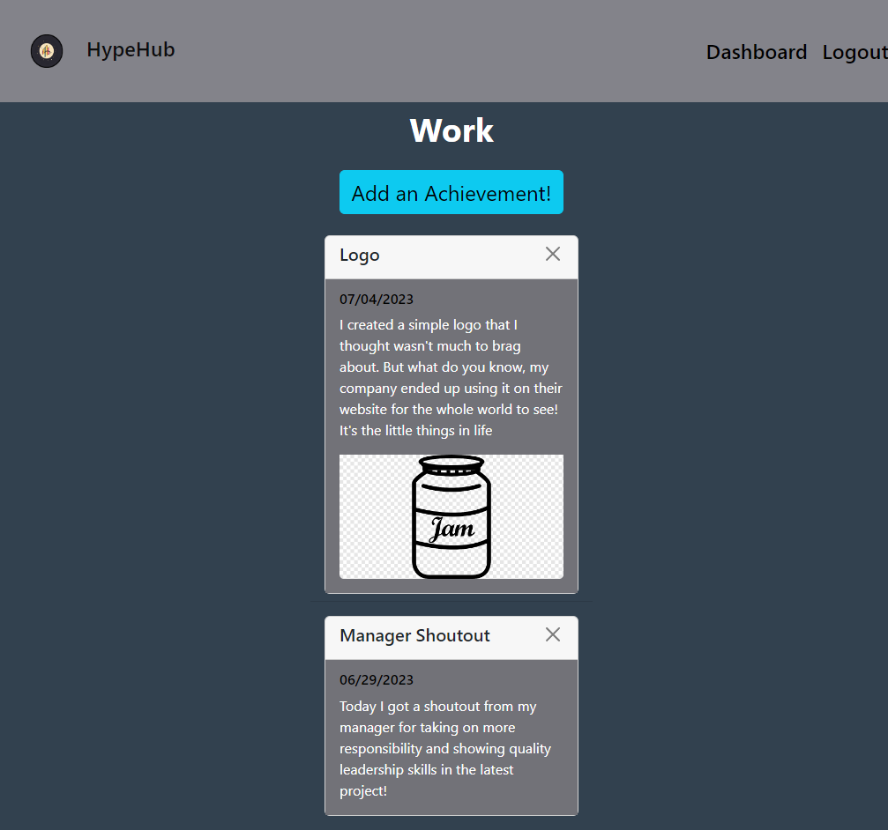

# HypeHub

## Description

HypeHub is an interactive application that allows users to document and showcase their achievements to reflect on growth, share progress with others, stay motivated.

## Built With

- Express.js
- MySQL
- Sequelize
- Cloudinary

## Getting Started

To get a local copy up and running follow these simple example steps.

### Installation

- Clone the repo
  ```sh
  git clone git@github.com:erikbenedict/hype-hub.git
  ```
- Install NPM packages
  ```sh
  npm i
  ```
- Create database in MySQL
  ```sh
  mysql -u root -p
  ```
  ```sh
  source ./db/schema.sql
  ```
  ```sh
  quit
  ```
- Add seed data to the database
  ```sh
  npm run seed
  ```
- (!! IMPORTANT !!) Make sure to create a `.env` file in the root. Use the `.env.EXAMPLE` as a template to add your MySQL username, password, and session secrete to create the connection

## Usage

To use this application, you must first register with your first and last name, email, and password. After submitting, you will be taken to the dashboard page where you can create a topic name to hold all your achievements! Create multiple topics to document achievements from all aspects of your life. Just click on the topic after creating it, and start recording your growth! You can even add a picture to your achievement to even better capture your success. You can add as many achievements and topics as you like! If you would like to delete anything that was created, simply click the "x" and then confirm that you truly wish to delete the item.

Below are some screenshots of the application!




## Deployed Application

[Click here to go to see what the Hype is all about!](https://achieved-it-a7cfbbbfd1a9.herokuapp.com/)

## Contributing

Contributions are what make the open source community such an amazing place to learn, inspire, and create. Any contributions you make are greatly appreciated.

If you have a suggestion that would make this better, please fork the repo and create a pull request. Don't forget to give the project a star! Thanks again!

1. Fork the Project
2. Create your Feature Branch (`git checkout -b feature/AmazingFeature`)
3. Commit your Changes (`git commit -m 'Add some AmazingFeature'`)
4. Push to the Branch (`git push origin feature/AmazingFeature`)
5. Open a Pull Request

## License

Distributed under the MIT License. See [MIT](https://choosealicense.com/licenses/mit/) for more information.

## Credits

- Erik Benedict: [https://github.com/erikbenedict](https://github.com/erikbenedict)
- Aipu Ameh: [https://github.com/AipuAmeh](https://github.com/AipuAmeh)
- Ilir Hajdari: [https://github.com/IlirHajdari](https://github.com/IlirHajdari)
- Rose Hobbs: [https://github.com/catfishcafe](https://github.com/catfishcafe)

## Contact

If you have any questions please reach out via email!

- Emails: erik.r.benedict@gmail.com, ilir.hajdari111@gmail.com, akmhobbs@gmail.com, aipuameh.16@gmail.com
- Project Link: [https://github.com/erikbenedict/hype-hub](https://github.com/erikbenedict/hype-hub)
